# Server-Side XOAuth2 with Mailer

This guide explains how to acquire the necessary credentials to use Gmail with the `mailer` package on a server (or any headless environment).

Unlike the "App Password" method, XOAuth2 is more secure and is the recommended way to access Gmail programmatically.

## Prerequisites

1. A Google Cloud Project.
2. The `mailer` package installed in your Dart project.

## Step 1: Google Cloud Console Setup

### 1. Create a Project

1. Go to the [Google Cloud Console](https://console.cloud.google.com/).  
   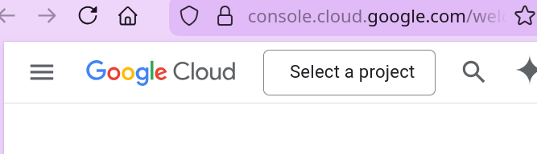

2. Click on the project dropdown and select **New Project**.  
   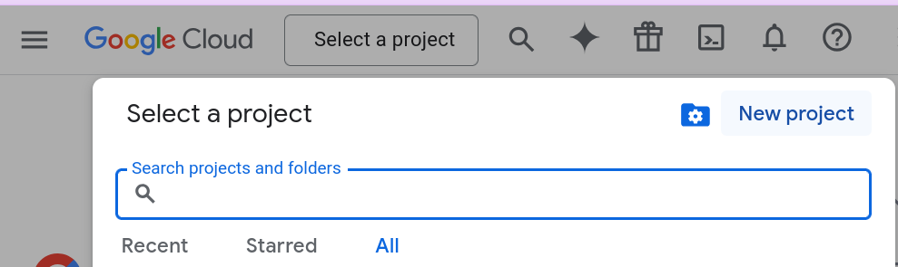

3. Enter a project name and click **Create**.  
   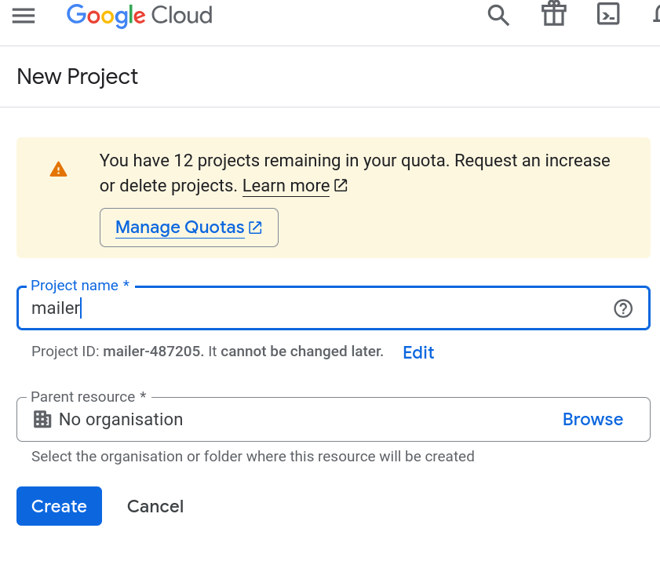

4. Select your newly created project.  
   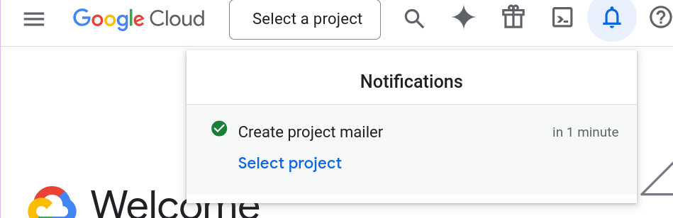

### 2. Enable Gmail API

1. Go to **APIs & Services > Dashboard**.  
   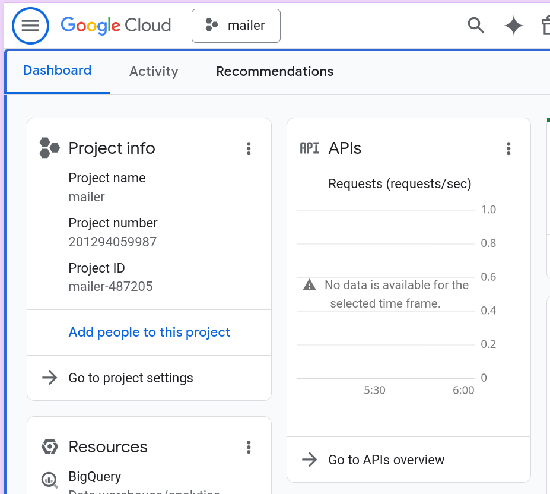

2. Click **Enable APIs and Services**.  
   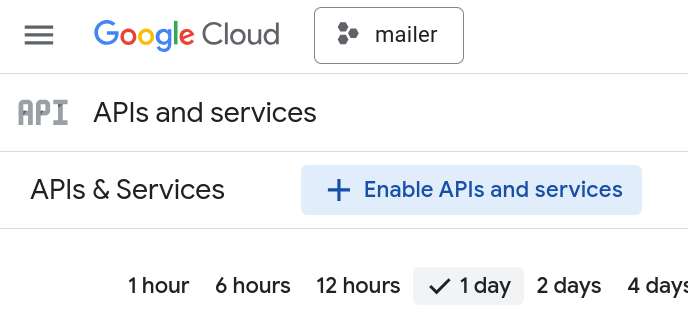

3. Search for `Gmail API`.  
   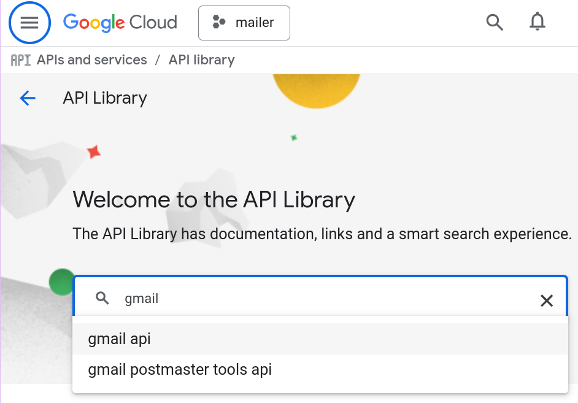

4. Select **Gmail API** from the results.  
   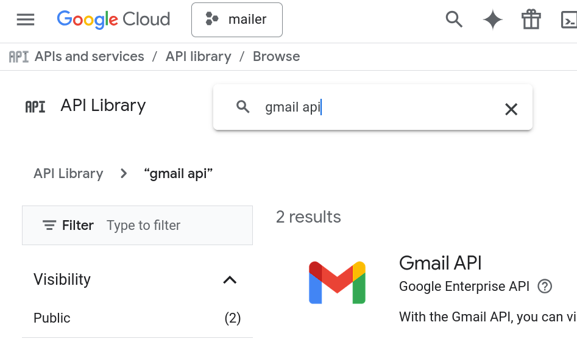

5. Click **Enable**.  
   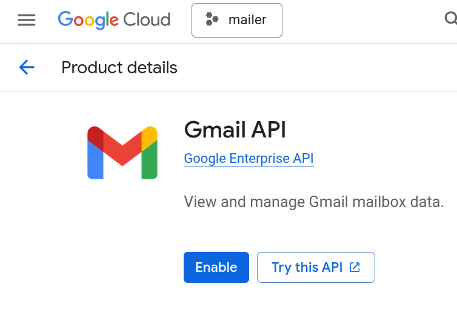

### 3. Configure OAuth Consent Screen

1. Go to **APIs & Services > OAuth consent screen**.  
   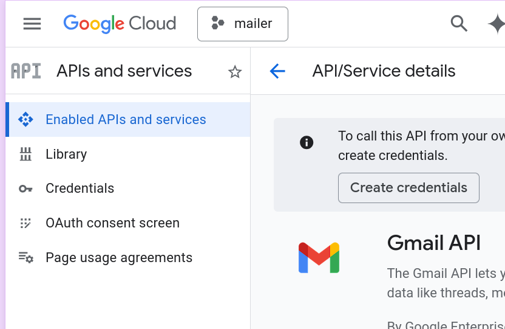

2. Click **Get Started** (or similar).
   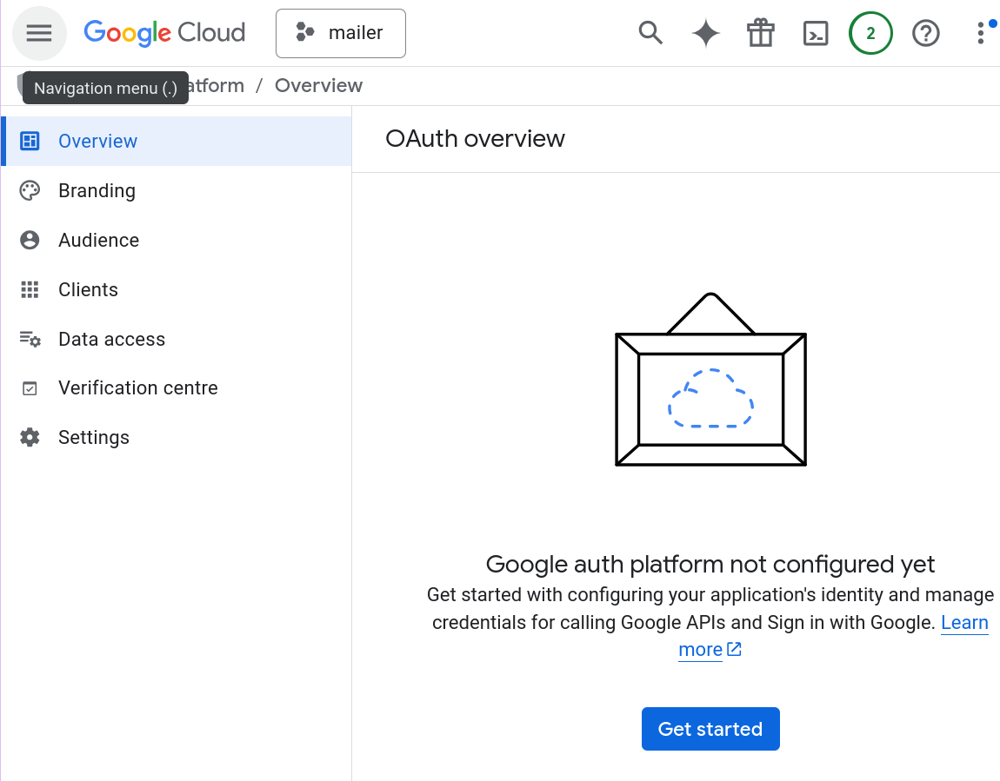

3. Fill in the required fields (App name, User support email).  
   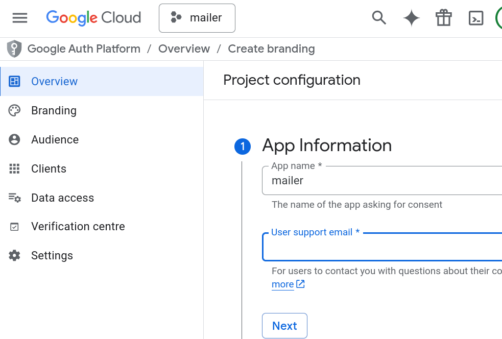

4. Select **External** (unless you are a G Suite user and want to limit to your organization) if prompted.   
   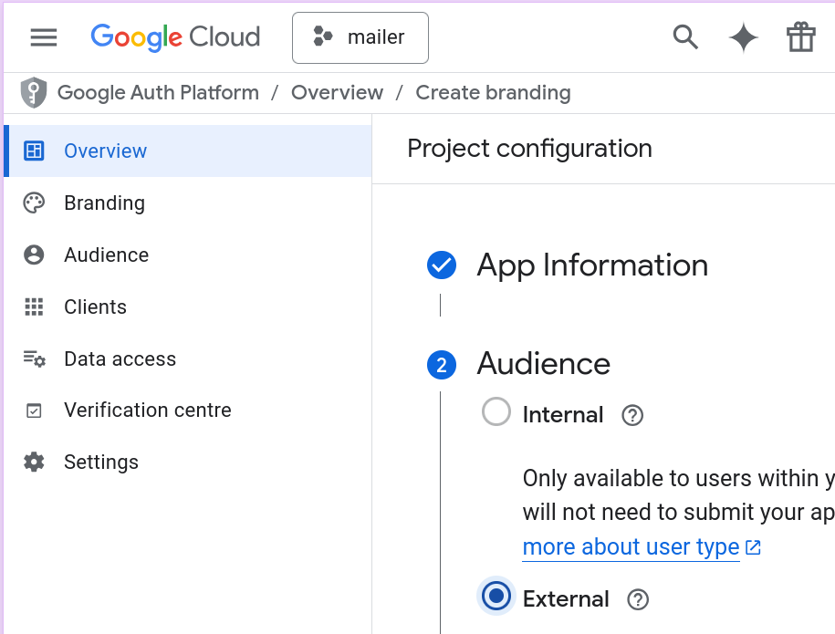

5. Add Developer contact information.  
   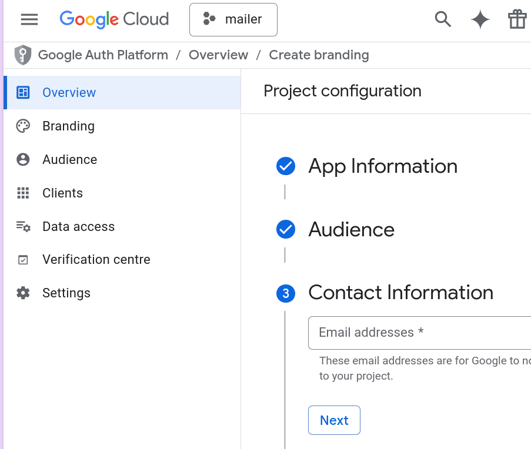

6. Continue through the steps.  
   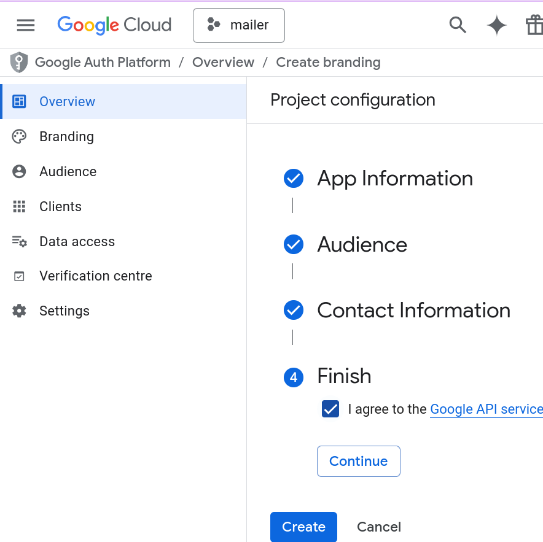

### 4. Create Credentials

1. Go to **APIs & Services > Credentials**.  
2. Click **Create Credentials** and select **OAuth client ID**.  
   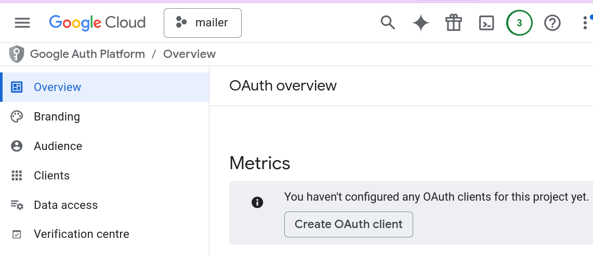

3. Application type: **Desktop app**.  
4. Name: Give it a name (e.g., "Mailer Server").  
5. Click **Create**.  
   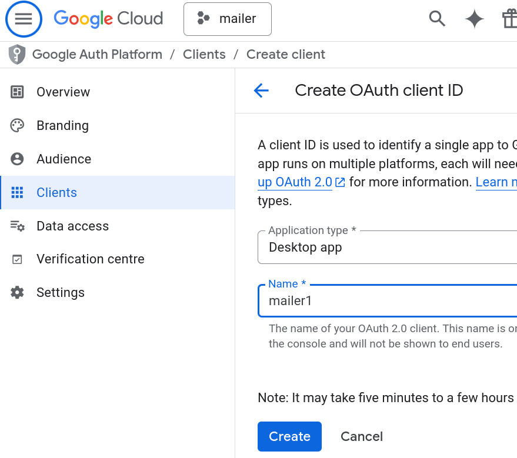

### 5. Finalize

1. Add **Test Users**: Add the email address you intend to use for sending emails. *This is critical if your app is in "Testing" mode.*  
   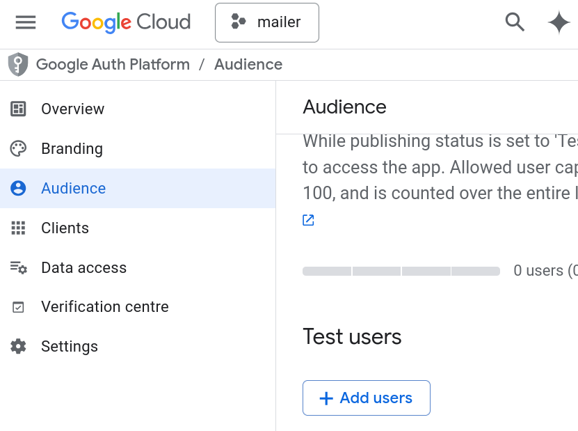

2. You will see a popup with your **Client ID** and **Client Secret**. Copy these or download the JSON file.

## Step 2: Acquire Refresh Token

You need a `refreshToken` to access Gmail without user interaction. The `accessToken` expires quickly (usually 1 hour), but the `refreshToken` works indefinitely (with some exceptions).

The `mailer` package includes a script to help you get this token.

Run the `obtain_credentials.dart` script with your Client ID and Client Secret:

```bash
dart example/gmail_xoauth2/obtain_credentials.dart \
  --id "YOUR_CLIENT_ID" \
  --secret "YOUR_CLIENT_SECRET" \
  --username "your.email@gmail.com" \
  --file "secrets.json"
```

The script will:
1. Print a URL and attempt to open it in your default browser.
2. Ask you to log in to your Google Account and grant permissions.
3. Once accepted, it will save the `refreshToken`, `identifier`, `secret`, and `username` to `secrets.json`.

> [!NOTE]
> If the browser doesn't open automatically, copy the URL printed in the terminal and open it manually.

## Step 3: Use in Your Application

Now you can load these credentials in your server application to send emails.

Check the [send_mail.dart](../../example/gmail_xoauth2/send_mail.dart) example file to see how to use the credentials
to send an email.

Run the example:
```bash
dart example/gmail_xoauth2/send_mail.dart --file secrets.json --to recipient@example.com
```
