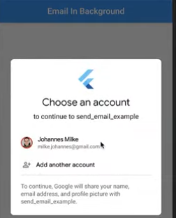

# How to use XOAUTH2 authentication in the [mailer](https://github.com/kaisellgren/mailer) lib

This example uses the [googleapis_auth](https://github.com/google/googleapis.dart/tree/master/googleapis_auth) library.

OAuth2 google credentials are explained [here](https://developers.google.com/identity/protocols/OAuth2)


## Get an app id

Go to the [API & Services dashboard](https://console.developers.google.com/apis/credentials) and
"create credentials" with type other.

You will get an app-`id` and an app-`secret`.

It should also be possible to create a service account.  However, AFAIK only google apps accounts
are allowed to do that.  For more information see [googleapis_auth → Autonomous Application / Service Account](https://github.com/google/googleapis.dart/tree/master/googleapis_auth)


## Server Side / Command Line Usage

This is acceptable if you are using `mailer` in a server (command line) app.

**See the [detailed manual](../../doc/gmail_xoauth2/README.md) for step-by-step instructions.**

First retrieve the credentials using [obtain_credentials.dart](obtain_credentials.dart):  
`dart example/gmail_xoauth2/obtain_credentials.dart --username 'yourAddress@gmail.com' --file 'secrets.json' --id 'YOUR_ID.apps.googleusercontent.com' --secret 'YOUR_SECRET'`

You can then send mails using:
`dart example/gmail_xoauth2/send_mail.dart --file 'secrets.json' --to 'someTestAddress@test.com'`


## Flutter Apps

**Do not use the server-side method above in Flutter apps.**  It requires storing your client secret, which is not secure in a mobile app.
Instead, use the [google_sign_in](https://pub.dev/packages/google_sign_in) package to authenticate the user.
This package handles the OAuth flow securely and provides the `accessToken` needed for `gmailSaslXoauth2`.

When the user authenticates, they will see a consent screen similar to this:



After obtaining the `accessToken` from `google_sign_in`, you can use it with `mailer`:

```dart
final googleSignIn = GoogleSignIn(scopes: ['https://mail.google.com/']);
final account = await googleSignIn.signIn();
final auth = await account.authentication;

final smtpServer = gmailSaslXoauth2(account.email, auth.accessToken);
// ... send email
```
